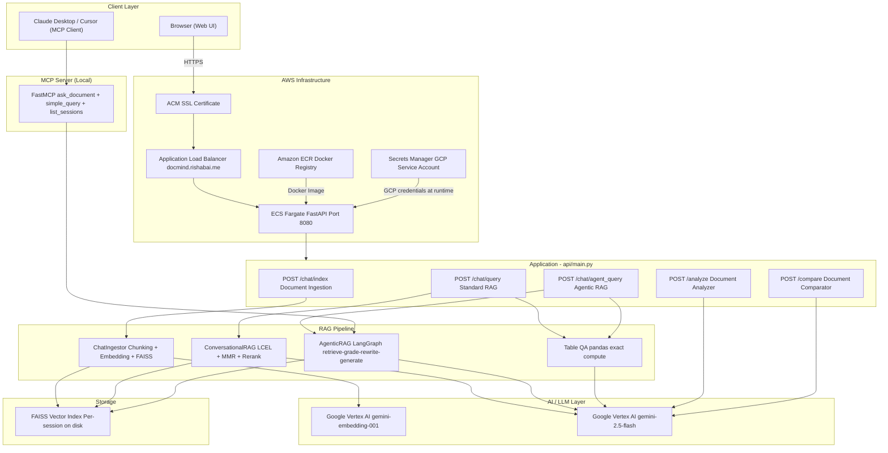
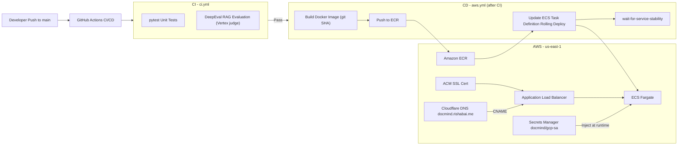

<div align="center">


# DocMind

*Many documents. Many formats. One place to ask.*

[Features](#features) · [How It Works](#how-it-works) · [Architecture](#system-architecture) · [Tech Stack](#tech-stack) · [Local Setup](#local-setup)

DocMind is an AI document platform that lets you upload files across **9+ formats** (PDF, DOCX, PPTX, TXT, Markdown, CSV, XLSX/XLS, JSON, SQLite) and ask questions in plain language. It pairs **conversational RAG** with an **agentic LangGraph engine**, extracts structured metadata, performs a structured **Added / Removed** comparison between two documents, and ships a built-in **MCP server** for Claude Desktop and Cursor. RAG quality is continuously measured with **DeepEval** (Answer Relevancy and Faithfulness) using Vertex Gemini as the judge. Every generation call runs on **Google Vertex AI (gemini-2.5-flash)**, and the app is deployed on **AWS ECS Fargate** with a full CI/CD pipeline.

**Live:** [docmind.rishabai.me](https://docmind.rishabai.me)

</div>

---


______


## Features

| Feature | Description |
|---|---|
| **Document Chat (Standard RAG)** | Conversational RAG over your files: FAISS retrieval with MMR, per-source coverage, adaptive top-k, and an optional cross-encoder reranker. Built on LangChain LCEL. |
| **Agentic RAG** | A LangGraph agent that retrieves, grades the retrieved context, rewrites the query when the context is weak, then answers. Better for broad or multi-hop questions. |
| **Exact Table & Spreadsheet Q&A** | For computational questions (totals, counts, averages, closing balances), DocMind runs a real pandas expression over the data for exact answers, then formats them cleanly. No hallucinated math. |
| **Document Analyzer** | Extracts structured metadata (title, summary, entities, dates, tone) from any supported document. |
| **Document Comparator** | Compares an original (reference) and an updated (actual) document and presents the differences as a two-column **Added / Removed** table. |
| **MCP Server** | Connect Claude Desktop or Cursor directly to your indexed documents as tools. |

Supported formats include PDF, DOCX, PPTX, TXT, Markdown, CSV, XLSX/XLS, JSON, and SQLite/DB files. The app is **open** (no login required).

---

## How It Works

DocMind ships two retrieval engines and routes each question to the right one.

**Standard RAG** (`ConversationalRAG`, LCEL) is the fast default. It embeds the question, retrieves the nearest chunks with MMR, tops up coverage so every source document is represented (important for summaries across many files), optionally reranks with a local cross-encoder, and answers. Use it for direct lookups, descriptions, and summaries.

**Agentic RAG** (`AgenticRAG`, LangGraph) adds a feedback loop: `retrieve → grade → rewrite → generate`. If the first retrieval is weak, it rewrites the query and tries again before answering. Use it for broad, vague, or multi-step questions where the first set of chunks may not be enough.

**Exact table compute** sits in front of both. When a question looks computational, DocMind loads the tabular files into pandas, has the model write a safe expression, evaluates it, verifies the numbers, and formats the result. This keeps aggregate answers exact and consistent instead of relying on whatever rows happened to be retrieved.

Performance is tuned end to end: Gemini "thinking" is disabled for the extraction and answer steps, retrieval k adapts to the question, and redundant LLM round-trips were removed, keeping typical answers fast.

---

## System Architecture



---

## AWS Infrastructure



---

## Tech Stack

### AI & LLM
| Component | Technology |
|---|---|
| LLM | Google Vertex AI (`gemini-2.5-flash`) for all generation, thinking disabled for latency |
| Embeddings | Google Vertex AI (`gemini-embedding-001`) |
| RAG Framework | LangChain LCEL |
| Agentic RAG | LangGraph (retrieve, grade, rewrite, generate) |
| Retrieval | FAISS with MMR, adaptive top-k, per-source coverage |
| Reranking | FlashrankRerank cross-encoder (optional, runs locally) |
| Table compute | pandas with a safe AST-evaluated expression and number verification |
| Evaluation | DeepEval (Answer Relevancy + Faithfulness), judged by the same Vertex Gemini |
| MCP Server | FastMCP, exposes RAG as tools for Claude Desktop / Cursor |

> The config also retains optional Groq and OpenAI provider blocks, but the deployed app runs entirely on Google Vertex AI.

### Backend
| Component | Technology |
|---|---|
| API Framework | FastAPI + Uvicorn |
| Frontend | Server-rendered Jinja templates + vanilla JS + static CSS |
| Vector Store | FAISS (per-session, disk-based) |
| Logging | `structlog`, structured JSON logs, console + file output |
| Exception Handling | Custom `DocumentPortalException` that captures file, line, and traceback |
| Access | Public (no authentication gate) |

### Infrastructure
| Component | Technology |
|---|---|
| Containerization | Docker (dependencies installed with `uv` for fast builds) |
| Container Registry | Amazon ECR |
| Compute | AWS ECS Fargate (serverless) |
| Load Balancer | AWS Application Load Balancer |
| SSL | AWS Certificate Manager (ACM) |
| Secrets | AWS Secrets Manager (GCP service-account JSON injected at runtime) |
| DNS | Cloudflare, CNAME to the ALB |
| CI/CD | GitHub Actions (`ci.yml` + `aws.yml`) |

---

## Project Structure

```
DocMind/
├── api/
│   └── main.py                    # FastAPI entrypoint - all routes
├── src/
│   ├── document_chat/
│   │   ├── retrieval.py           # ConversationalRAG (LCEL + MMR + rerank)
│   │   ├── agent_rag.py           # AgenticRAG (LangGraph)
│   │   ├── table_qa.py            # Exact pandas compute for tables/spreadsheets
│   │   └── multimodal/            # Multimodal pipeline (disabled by default)
│   ├── document_analyzer/         # Metadata extraction
│   ├── document_compare/          # Document diff (Added / Removed)
│   └── document_ingestion/        # Chunking, embedding, FAISS indexing
├── mcp_server/
│   └── server.py                  # FastMCP server (local use)
├── eval/
│   └── run_doc_chat_deepeval.py   # DeepEval - RAG quality (Vertex judge)
├── utils/                         # ModelLoader, config, cache
├── prompt/                        # Prompt registry
├── model/                         # Pydantic response models
├── logger/                        # structlog global logger
├── exception/                     # Custom exception
├── config/config.yaml             # LLM + embedding config
├── .github/workflows/
│   ├── ci.yml                     # Tests + DeepEval on every push
│   └── aws.yml                    # Build + Deploy on main
├── entrypoint.sh                  # Writes GCP creds, starts uvicorn (prod)
└── Dockerfile
```

---

## Local Setup

```bash
# 1. Clone and install
git clone https://github.com/Rishab-Panwar/DocMind.git
cd DocMind
pip install -r requirements.txt   # or: uv pip install -r requirements.txt

# 2. Configure Google Vertex AI credentials
cp .env.example .env
# Set in .env:
#   USE_VERTEX=true
#   GOOGLE_APPLICATION_CREDENTIALS=/absolute/path/to/gcp-service-account.json
#   GOOGLE_CLOUD_PROJECT=your-gcp-project
#   GOOGLE_CLOUD_LOCATION=us-central1
#   VERTEX_TRANSPORT=rest

# 3. Run the API
uvicorn api.main:app --host 0.0.0.0 --port 8080 --reload
```

Open [http://localhost:8080](http://localhost:8080)

### MCP Server (Claude Desktop integration)

```bash
pip install mcp
python mcp_server/server.py
```

Add to `claude_desktop_config.json`:
```json
{
  "mcpServers": {
    "docmind": {
      "command": "python",
      "args": ["/absolute/path/to/mcp_server/server.py"]
    }
  }
}
```

Available tools: `ask_document` (agentic RAG), `simple_query` (fast RAG), `list_sessions`.

---

## CI/CD Pipeline

```
Push to main
  └── ci.yml
        ├── test       → pytest tests/
        └── deepeval   → RAG evaluation, judged by Vertex Gemini (non-blocking)
              └── [pass] → aws.yml
                            ├── Build Docker image (tagged with git SHA, built via uv)
                            ├── Push to Amazon ECR
                            ├── Update ECS Task Definition
                            └── Rolling deploy → wait-for-service-stability
```

- The DeepEval job is non-blocking, so an eval hiccup never blocks a deploy.
- Every image is tagged with `${{ github.sha }}`, so each deploy traces back to a commit.
- CD only runs after CI passes on `main`.

---

## Evaluation - DeepEval

RAG quality is checked on every CI run with [DeepEval](https://github.com/confident-ai/deepeval), using the **same Vertex Gemini the app uses** as the judge (via the GCP service-account credentials), so no extra API key is needed.

| Metric | Measures |
|---|---|
| Answer Relevancy | Is the answer relevant to the question? |
| Faithfulness | Is the answer grounded in the retrieved context? |

Judge model: `gemini-2.5-flash` on Google Vertex AI.
